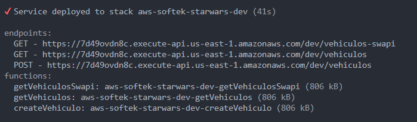

# Despliegue de Proyecto con Serverless

Este proyecto utiliza Serverless Framework para desplegar una API en AWS Lambda y API Gateway.

## Requisitos Previos

Antes de desplegar el proyecto, asegúrate de tener lo siguiente instalado en tu sistema:

- Node.js y npm
- Serverless Framework (instalado globalmente)

Puedes instalar Serverless Framework globalmente utilizando el siguiente comando:

```bash
npm install -g serverless
```

Además, necesitarás configurar tus credenciales de AWS en tu sistema para que Serverless pueda interactuar con tu cuenta de AWS.

## Instalación

1. Clona este repositorio en tu máquina local:

```bash
git clone https://github.com/alonsobustamante/softek-serverless-aws.git
```

2. Navega al directorio del proyecto:

```bash
cd softek-serverless-aws
```

3. Instala las dependencias del proyecto:

```bash
npm install 
```

## Configuración

Antes de desplegar, asegúrate de configurar cualquier variable de entorno necesaria en el archivo `serverless.yml`.

## Despliegue

Una vez que hayas configurado el proyecto, puedes desplegarlo con el siguiente comando:

```bash
serverless deploy
```

Este comando desplegará tu API en AWS Lambda y API Gateway según la configuración especificada en el archivo `serverless.yml`.

## Uso

Después del despliegue exitoso, recibirás las URL de los endpoints de tu API. Puedes usar estas URL para acceder y probar tu API.


